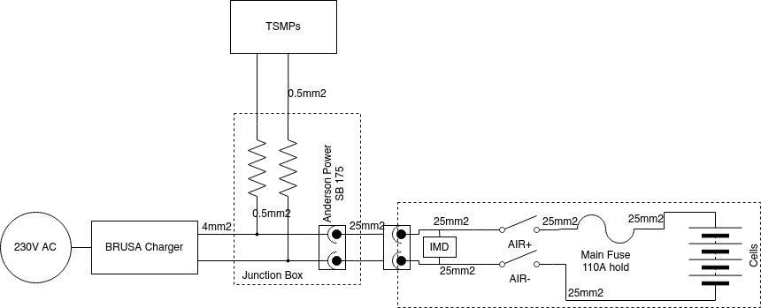
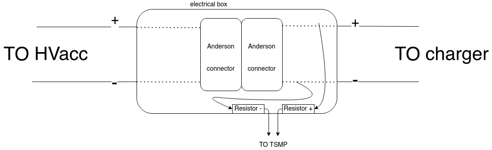
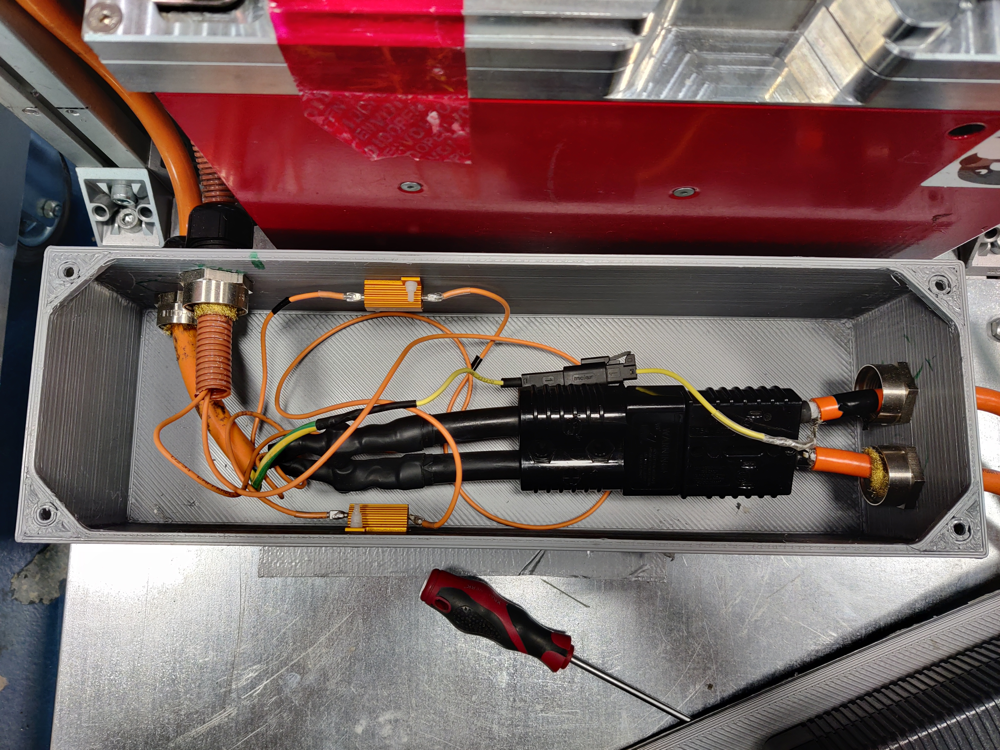
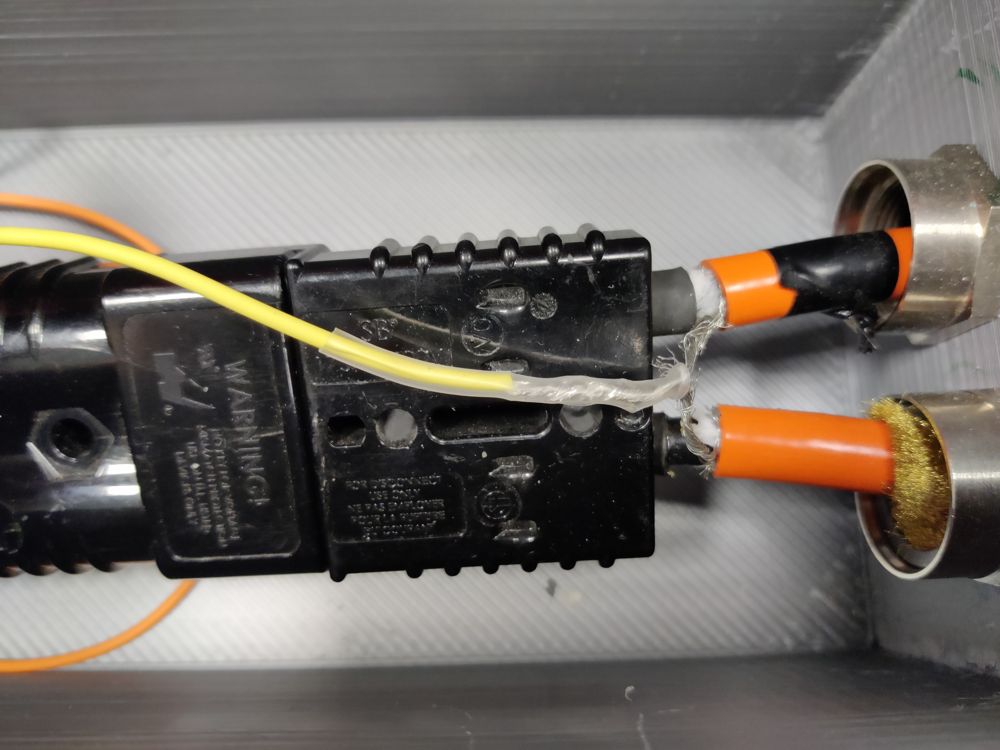
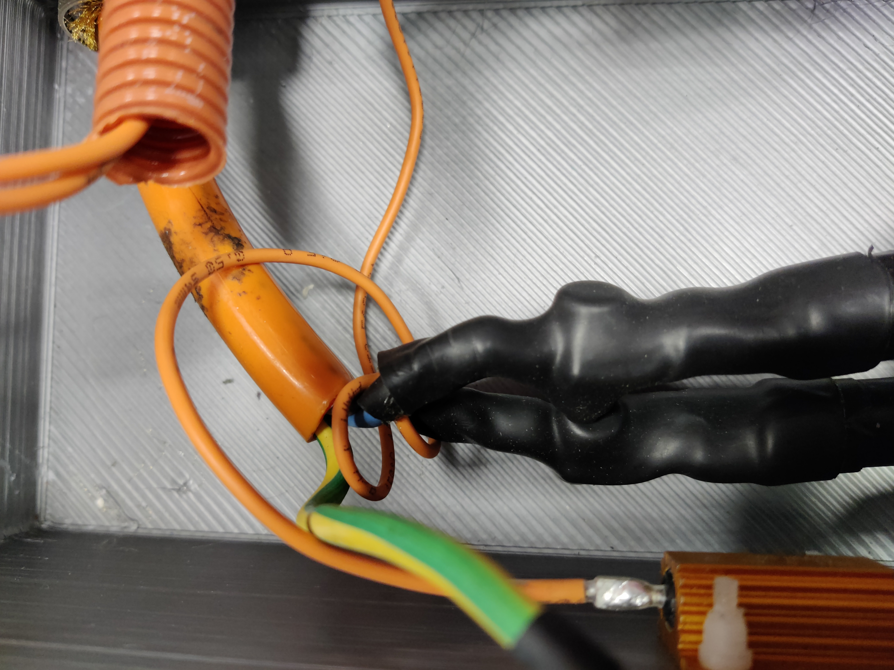
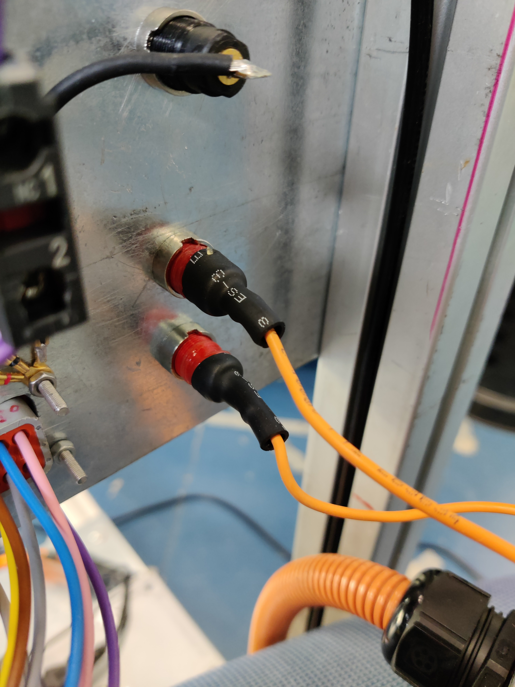
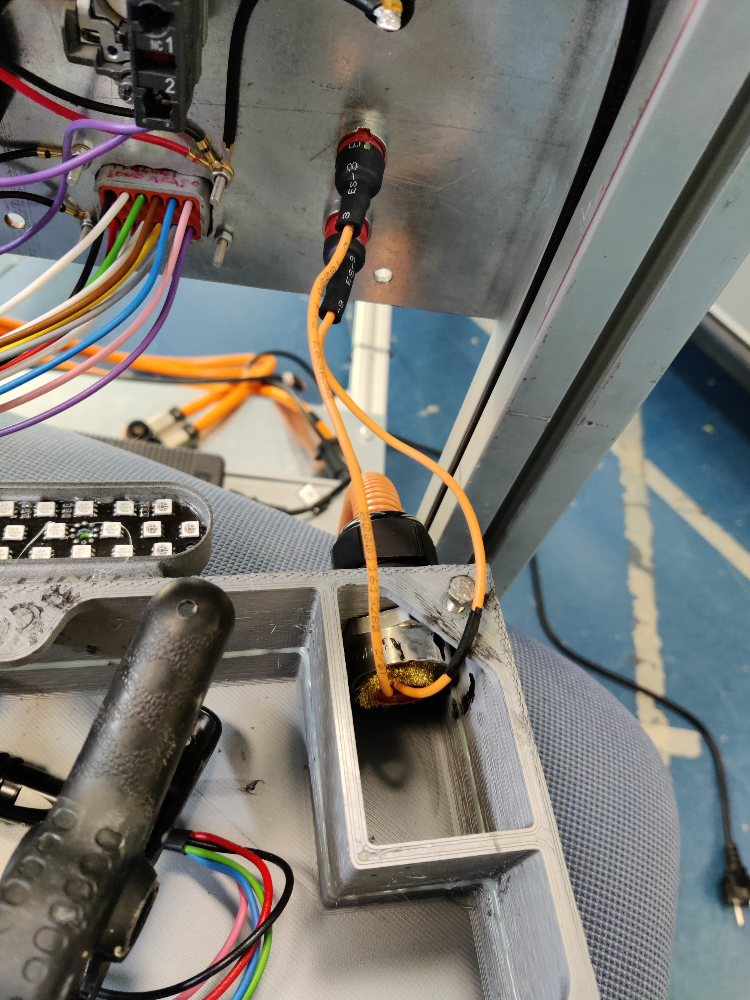
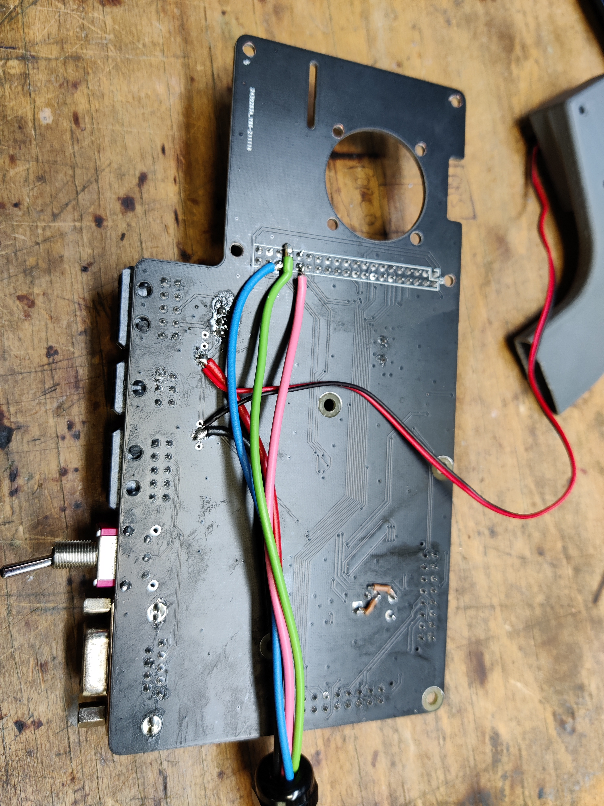
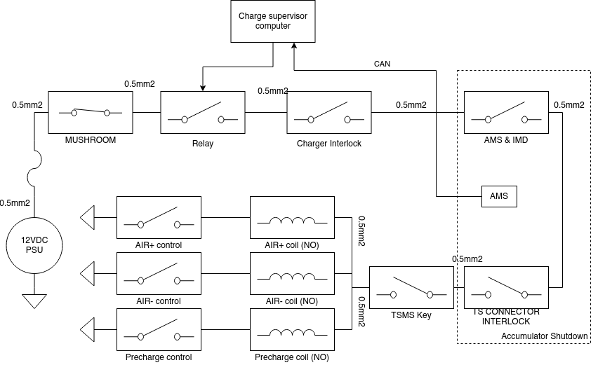

# Hancart Hardware Documentation

## Electrical wiring

### TS Tractive System Wiring

The TS wiring is described in this diagram:

#### The junction box
The TS cable that goes from the BRUSA to the accumulator has a connector in order of being able to charge both the Chimera's acc and the Fenice one. This is done by using a custom cable for each accumulator. The connector is inside a junction box. This box also have the TSMPs resistors.

The shields of the cables from the accumulator are connected to PE (protective earth) coming from the cable of the BRUSA trough a molex connector.

All the cables exiting the junction box are restrained using some cable restrains from lapp.

#### The TSMP
The TS measurament points are connected to the TS+ and TS- in the junction box, having a proper resistor in series.

### The handcart wiring & PCB connectors
All the Shutdown cables in the wiring have purple color.

#### RGB TSAL (fake)
The TSAL is used to get a visual feedback of the state of the handcart during charging. The original fenice's TSAL has been taken and has been equiped with RGB leds, connetting the mosphet gates to some pins in the raspberry, specifically:
- RED_LED = GPIO 12 #31
- GREEN_LED = GPIO 13 #33
- BLUE_LED = GPIO 16 #36

Some cables has been routed from the back of the pcb to a weipu 6 pin female cable-to-cable connector. Then, the male connector is connected to the TSAL. The pin assignment is:

-   1 - GND
-   2 - 12V
-   3 - Red signal
-   4 - Green signal
-   5 - Blue signal

A view of the soldered cables of the fake TSAL and the fan.

## The shutdown circuit

The shutdown circuit is generated from the PSU, it passes trough a fuse, it passes through the mushroom, to a relay which is controlled by the rasp, then TO_CHARGER, which is the interlock of the connector of the brusa, and then FROM_CHARGER to BMS’s SD, then out of the BMS, to the TSMS key, then in to the BMS again to the airs.
Note that the PON (Power ON) of the BRUSA is powered from the shutdown circuit, this way, if the shutdown is opened, the BRUSA is instantaneously disabled.

## Handcart PCB

### Components list
- Brusa NLG513 - HV charger
- Anderson SB 165A-600V - Connector of TS from brusa to accumulator
- Amphenol AT06-12S - Connector of communication cable to accumulator
- CGS HSA25 15K G 1731 - TSMP resistors
- Lapp Oflex FD 90 CV 16mm2 - TS cables
- TE connector 770680-1 - Connector of brusa communciation
- Lapp SKINTOP ST-M Cable restrain - Cable restrain for TS cables